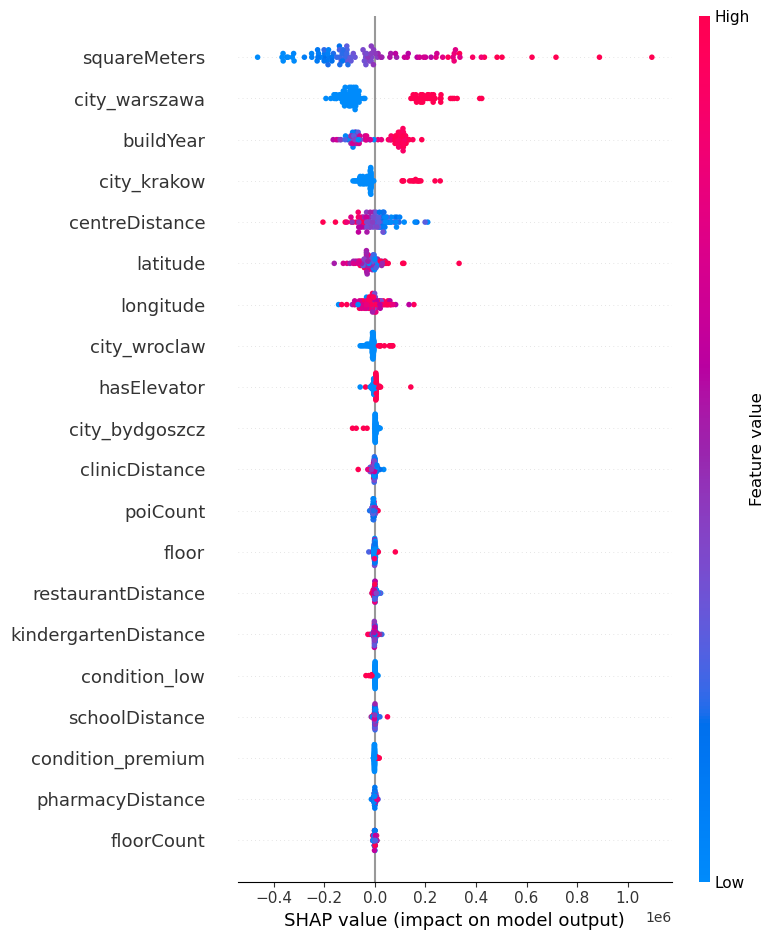

# Poland Apartments Valuation & Deal Finder
(Machine Learning | Random Forest | SHAP | Folium)

> **Cel projektu:** Stworzenie modelu ML do wyceny nieruchomości w Polsce oraz narzędzia wykrywającego rynkowe "okazje" (mieszkania niedowartościowane).

## Business Case
Rynek nieruchomości jest dynamiczny. Kupujący mają problem z oceną, czy cena ofertowa jest uczciwa.
Ten projekt rozwiązuje ten problem poprzez:
1.  **Obiektywną wycenę:** Model uczy się na tysiącach ofert, ignorując emocje sprzedającego.
2.  **Wykrywanie okazji:** Algorytm porównuje cenę ofertową z predykcją modelu. Jeśli `Cena Ofertowa << Wycena Modelu`, oznaczamy to jako okazję inwestycyjną.

## Technologie
* **Python:** Pandas, NumPy (Data Cleaning & Manipulation)
* **Machine Learning:** Scikit-Learn (Random Forest Regressor)
* **Explainable AI:** SHAP (Interpretacja decyzji modelu)
* **Wizualizacja:** Matplotlib, Seaborn, Folium(Interaktywna mapa)

## Workflow

### 1. Data Cleaning & Feature Engineering
Dane z serwisu Kaggle wymagały solidnego czyszczenia:
* Usunięto duplikaty i obsłużono braki danych (np. medianą dla odległości).
* **Outliers:** Odrzucono luksusowe apartamenty i błędy danych, co poprawiło stabilność modelu.
* **One-Hot Encoding:** Zamiana zmiennych kategorycznych (Miasto, Stan) na liczby.

### 2. Modelowanie
Wykorzystano algorytm **Random Forest Regressor** (Las Losowy).
* Model jest odporny na nieliniowe zależności (np. wpływ piętra na cenę w zależności od miasta).
* Zastosowano podział Train/Test (80/20).

### 3. Wyniki
Model osiągnął bardzo wysoką skuteczność:
* **R² Score:** 0.97 (Model wyjaśnia 97% zmienności cen).
* **MAE (Mean Absolute Error):** 34853.49 PLN.

### 4. Interpretacja
Dzięki analizie SHAP wiemy, co kieruje cenami:
* Najważniejszym czynnikiem jest **Metraż** oraz **Lokalizacja**.
* Standard wykończenia ("premium") znacząco podnosi wycenę.

## Mapa Okazji
Wygenerowano mapę z zaznaczonymi mieszkaniami, które model uznał za największe okazje cenowe.

![Mapa Folium][(mapa_okazji.png)](https://sikorski06.github.io/Analysis-of-apartments-prices-in-Poland/mapa_okazji.html)

## Kontakt
Projekt wykonany przez: **Piotr Sikorski** piotr.xsikorski@gmail.com
